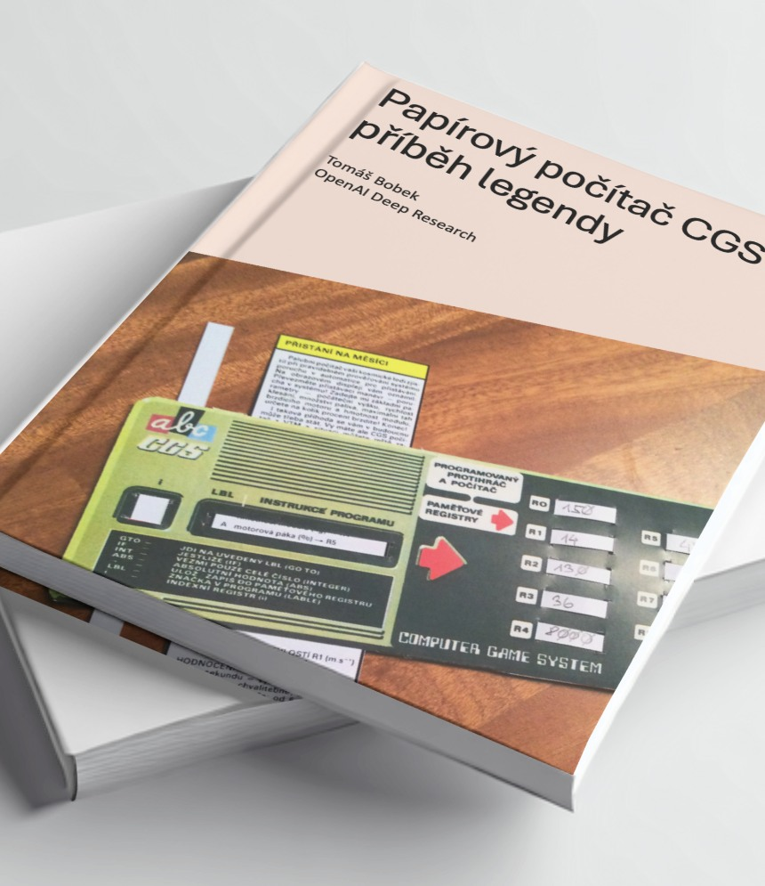

# Papírový počítač CGS – příběh legendy

Fanouškovská dokumentace o jedinečném papírovém počítači CGS, který v 80. letech přivedl tisíce československých dětí k programování – bez čipu, bez obrazovky, jen s tužkou a papírem.

## 🧠 O čem to je?

> CGS (Computer Game System) byl ručně ovládaný simulátor počítače publikovaný jako vystřihovánka v časopisu ABC v roce 1980. Tato publikace mapuje jeho historii, princip, jazyk a didaktický význam.

- Vznik a vývoj CGS v ABC, VTM a dalších médiích
- Technická rekonstrukce a principy fungování
- Popis symbolického programovacího jazyka
- Význam CGS ve výuce informatiky v 80. letech
- Srovnání se zahraničními papírovými počítači

## 📚 Stažení knihy

| Formát | Odkaz |
|--------|-------|
| 📄 PDF  | [Stáhnout](books/Papirovy_pocitac_CGS_Tomas_Bobek.pdf) |
| 📱 EPUB | [Stáhnout](books/Papirovy_pocitac_CGS_Tomas_Bobek.epub) |
| 📘 MOBI | [Stáhnout](books/Papirovy_pocitac_CGS_Tomas_Bobek.mobi) |

> Verze: 1.0 (23. 3. 2025)  
> Autor: [Tomáš "Tombo" Bobek](https://github.com/TomboCZ)  
> Licence: CC BY-NC-ND 4.0

## 🔍 Odkazy a zdroje

- [Článek o CGS na Root.cz](https://www.root.cz/clanky/papirovy-pocitac-cgs/)
- [Wikipedie: Papírový počítač CGS](https://cs.wikipedia.org/wiki/Pap%C3%ADrov%C3%BD_po%C4%8D%C3%ADta%C4%8D_CGS)

## 🤝 Spolupráce

Pokud najdete chybu nebo máte nápad na doplnění, otevřte issue. Historie CGS si zaslouží co nejpřesnější rekonstrukci.

## ☕ Kafe pro autora

CGS je zdarma, kofein ne.  Líbilo? Nakoplo?  
Kup autorovi kafe na [Buy me a coffee](https://buymeacoffee.com/tbobekczf) a třeba ještě něco napíše.

